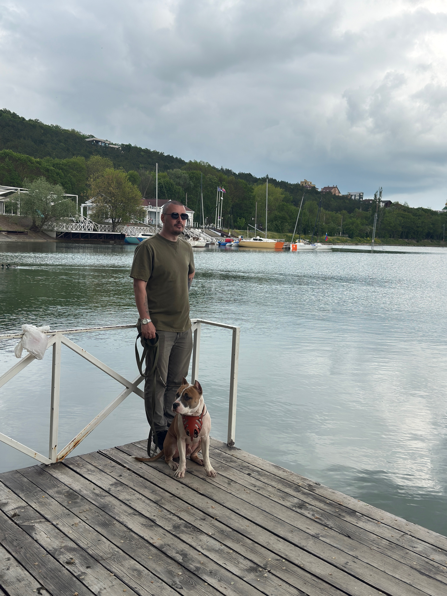

# Портфолио: Никита, Junior QA Engineer

  
> **Формат:** удалённо  
> **Желаемая позиция:** тестировщик ПО (Junior) / стажировка  
> **Контакты:** +7 999 065-00-16 (основной), [nikita4651@ya.ru](mailto:nikita4651@ya.ru)
> **Telegram:** [@Nikita_4651]  [Telegram](https://t.me/Nikita_4651)
---

## Кратко о себе

Студент, прохожу курс **«Инженер по тестированию: расширенный курс» в Нетологии** (март 2026 — н.в.). Делаю упор на автоматизацию: Java + Selenide + JUnit 5 + Allure, сборка через Gradle, работа с БД (MySQL) в Docker.

**Почему это важно:** я не просто «прошёл лекции», а сделал учебную курсовую с реальным циклом тестирования: тест‑кейсы, баг‑репорты в Jira, автотесты, отчёты Allure, настройка docker‑compose и JDBC‑проверки. Всё могу показать в репозитории и прогнать на демо.

---

## Стек технологий

- **Языки и фреймворки:** Java, Selenide, JUnit 5, Lombok (аннотации `@Data`, `@Builder` и др.)
- **Сборка и CI:** Gradle (build.gradle), задачи запуска тестов, понимание CI‑процессов
- **БД и бэкенд:** MySQL, JDBC‑проверки, базовые SQL‑запросы
- **Инфраструктура:** Docker / docker‑compose, volumes, запуск и остановка контейнеров
- **Ручное тестирование:** smoke, регрессионное, интеграционное, тест‑дизайн (чек‑листы, тест‑кейсы), покрытие по ветвям
- **Инструменты:** Jira (баг‑репорты), Git/GitHub, DevTools (Network, Console), Postman, Allure

---

## Проекты и практика

### 1. Автотесты банковской системы (курсовая работа)

**Цель проекта:** автоматизировать проверку основных банковских операций и валидацию данных в БД.

**Что реализовано:**
- Сценарии: оплата, покупка, покупка в кредит, обработка невалидных данных.
- Архитектура: Page Object, параметризованные тесты (JUnit 5), Allure‑отчёты.
- Сборка: запуск тестов через Gradle в IDE и CLI.
- Валидация: JDBC‑проверки баланса и транзакций, SQL‑запросы для подтверждения корректности данных.

**Результаты:**
- Покрытие по ветвям (цель—100%).
- Отчёты Allure с наглядной статистикой и упавшими тестами.
- Баг‑репорты в Issues: шаги воспроизведения, ожидаемый/фактический результат, скриншоты, логи.

**Результат:** [Задание](https://github.com/Nikita4651/HW7)
**Отчёты:** [Задание с отчетом](https://github.com/Nikita4651/HW10)

---

### 2. Docker‑окружение и БД

**Цель:** поднять тестовое окружение и обеспечить стабильную работу автотестов.

**Что сделано:**
- docker‑compose для MySQL и приложения, настройка volumes.
- Настройка JDBC‑URL, параметров подключения, проверка видимости БД из приложения.
- Отладка ошибок доступа (Access denied), подбор корректных параметров, проверка сети между контейнерами.

**Результат:** стабильный запуск тестов.

**Где посмотреть:** [Задание](https://github.com/Nikita4651/HW9)

---

### 3. Ручное тестирование и баг‑трекинг

**Цель:** отработать полный цикл ручного тестирования и оформления дефектов.

**Что делал:**
- Составлял чек‑листы и тест‑кейсы (позитивные/негативные), применял техники тест‑дизайна (граничные значения, классы эквивалентности).
- Тестировал UI: формы, кнопки, валидацию, сообщения об ошибках.
- Анализировал сетевые запросы и ошибки в DevTools.
- Оформлял баг‑репорты в Jira с чёткими шагами, скриншотами и логами.

**Примеры дефектов:** локализация NullPointerException, NumberFormatException, StringIndexOutOfBoundsException; подтверждение исправлений автотестами и JDBC‑проверками.

 **Где посмотреть все ссылки на полную работу ручного тестирования:** [Задание ручного тестирование](https://disk.yandex.ru/edit/d/FgraY_FWf3alDqO54ueBCSPegnqahzm72s0qoIz-cKg6MkJucUhLMTk4dw?source=docs&sk=ye99127ab769dfc4a342ba7728ce6a9ea)
Объект тестирования: интернет-магазин https://henderson.ru.

---

## Обучение

- **Нетология — «Инженер по тестированию: расширенный курс»** (март 2026 — н.в.)  
  Освоены: ручное тестирование, основы автоматизации, тест‑дизайн, Jira, Git, Postman, DevTools, отчётность.

---

## Что я умею делать прямо сейчас

1. Запускать автотесты и читать Allure‑отчёт: видеть, где тест упал, и смотреть логи.
2. Находить элементы через Selenide (CSS/XPath), добавлять ожидания, чтобы тесты не падали на динамических элементах.
3. Поднимать БД в Docker, подключать приложение, проверять данные через JDBC.
4. Оформлять баг‑репорт так, чтобы разработчик мог быстро воспроизвести проблему.
5. Читать стектрейс и локализовать ошибку (NullPointerException, NumberFormatException и др.).

---

## Как со мной работать

- Готов к стажировке и интенсивной доучиваемости.
- Могу показать проекты и объяснить, как запускаю тесты и разбираю ошибки.
- Предпочитаю чёткие задачи и критерии приёмки; люблю, когда требования оформлены в Jira или README.

---

## Ссылки (куда ставить)

| Категория                                       | Что сюда вставить                                           |
|-------------------------------------------------|-------------------------------------------------------------|
| Репозиторий проекта,Allure‑отчёты,Docker‑файлы,Примеры баг‑репортов | [Курсовая работа](https://github.com/Nikita4651/Coursework) |

**Сертификаты:**
1. [Сертификат об оканчании модуля](certificates/certificate.pdf)
2. [Сертификат об оканчании модуля](certificates/certificate1.pdf)
3. [Сертификат об оканчании модуля](certificates/certificate11.pdf)
4. [Сертификат об оканчании модуля](certificates/certificate12.pdf)
5. [Сертификат об оканчании модуля](certificates/certificate%20%D0%BF%D0%BE%204%20%D0%BC%D0%BE%D0%B4%D1%83%D0%BB%D1%8F%D0%BC.pdf)

---

## Контакты

- Телефон (предпочтительный): +7 999 065-00-16
- Email: [nikita4651@ya.ru](mailto:nikita4651@ya.ru)
- Telegram: [@Nikita_4651]  [Telegram](https://t.me/Nikita_4651)